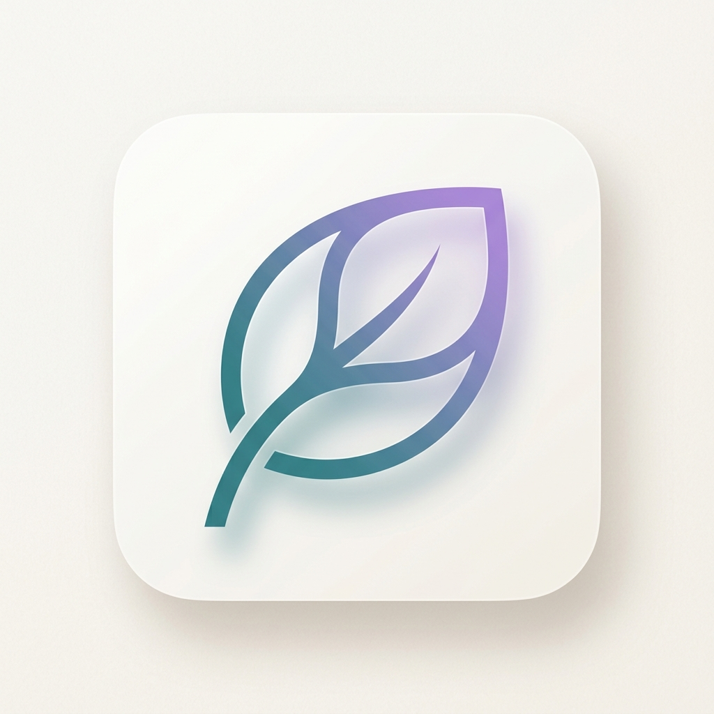

# Emotional Journal (Jurnal Emosi)

Aplikasi *micro-journaling* berbasis Progressive Web App (PWA) yang dirancang untuk membantu pengguna melacak, merilis, dan memahami pola emosi harian dengan antarmuka yang tenang dan meditatif.



## ✨ Filosofi Desain
"Emotional Journal" bukan sekadar aplikasi pencatatan. Ia adalah *safe space* digital. Kami menggunakan estetika **Warm and Minimalist**, tipografi yang elegan, serta mikro-antarmuka yang responsif untuk menciptakan pengalaman meditasi visual saat pengguna berinteraksi dengan emosi mereka.

## 🛠️ Tech Stack Utama
Aplikasi ini dibangun dengan teknologi terkini untuk memastikan performa yang cepat, aman, dan bisa diakses dari perangkat mana pun:
- **Framework**: [Next.js 16](https://nextjs.org/) (App Router & Turbopack)
- **Styling**: [Tailwind CSS](https://tailwindcss.com/) & [Shadcn UI](https://ui.shadcn.com/)
- **Backend/DB**: [Supabase](https://supabase.com/) (Real-time Database & SSR Auth)
- **State & Data**: [TanStack Query v5](https://tanstack.com/query) dengan *Offline State Persistence*.
- **PWA**: [@serwist/next](https://serwist.github.io/serwist/) untuk dukungan full offline dan instalasi native di iOS/Android.

## 🌟 Fitur Utama

### 1. Galaxy Mesh Heatmap
Visualisasi kalender unik yang menggambarkan spektrum emosi Anda. Jika dalam satu hari terdapat beberapa entri emosi, kalender akan menampilkan gradasi warna yang indah (Mesh Gradient), menciptakan pola unik setiap bulan.

### 2. Sesi Release Emosi
Fitur terapi mandiri terpandu dengan 5 tahapan utama:
- **Sadari perasaan yang datang**: Menghadirkan kesadaran penuh terhadap gejolak emosi.
- **Izinkan perasaan itu ada**: Mengamati keberadaan emosi tanpa mencoba membendungnya.
- **Rasakan, jangan dilawan**: Merasakan sensasi emosi di tubuh dengan ritme napas (Tarik-Tahan-Buang).
- **Lepaskan, biarkan mengalir**: Menuliskan dan merilis beban emosi secara visual (Dissolve animation).
- **Ikhlas Seperti Napas**: Menenangkan diri kembali dengan afirmasi "Ya Allah mudahkan ikhlasku semudah nafasku".
- **Serahkan pada Allah**: Kepasrahan total dan refleksi spiritual untuk ketenangan batin.

### 3. Monetization & Security Gate
Sistem aktivasi akun berbasis lisensi. Pengguna hanya dapat mengakses Dashboard penuh setelah melakukan aktivasi menggunakan kode akses unik, memungkinkan model bisnis SaaS atau penjualan lisensi mandiri.

### 4. Zero-Friction Logging
Formulir input yang cepat dengan pilihan emosi berbasis *chip* warna-warni, memungkinkan pencatatan perasaan kurang dari 10 detik.

## 🛠️ Solusi Kendala Teknis (Troubleshooting)

### 1. Kebocoran Data Cache (Account Switching)
- **Masalah**: Data dari akun sebelumnya tetap terlihat saat pengguna lain login di browser yang sama.
- **Solusi**: Mengimplementasikan **Query Key Partitioning** (menambahkan `userId` ke kunci cache) dan **Explicit Clearance** (memanggil `queryClient.clear()` pada alur logout).

### 2. Build Failure (Vercel)
- **Masalah**: Kegagalan build di Vercel karena struktur folder subdirektori.
- **Solusi**: Memindahkan proyek Next.js dari folder `EJ/` langsung ke **root directory** agar terdeteksi secara otomatis oleh Vercel.

### 3. Looping pada Tahap "Lepaskan"
- **Masalah**: Saat sesi release emosi, alur berhenti dan mengulang (loop) di tahap penulisan teks.
- **Penyebab**: Ketidaksesuaian indeks langkah (*step index*) pada fungsi `handleDissolve` dan `useEffect` setelah reposisi tahapan menjadi 5 langkah.
- **Solusi**: Sinkronisasi pemetaan alur langkah sehingga Langkah 5 (Lepaskan) secara konsisten diteruskan ke Langkah 6 (Serahkan pada Allah).

## 🚀 Instalasi & Pengembangan
1. **Clone & Install**:
   ```bash
   npm install
   ```
2. **Setup Env**: Pastikan Anda memiliki kredensial Supabase di `.env`.
3. **Run Dev Server**:
   ```bash
   npm run dev
   ```
4. **Build Production**: 
   ```bash
   npm run build
   ```

---
*Developed with focus on Mental Health and UX Excellence.*  
**Built by [Fauzihiz](https://fauzihiz.github.io/)**
